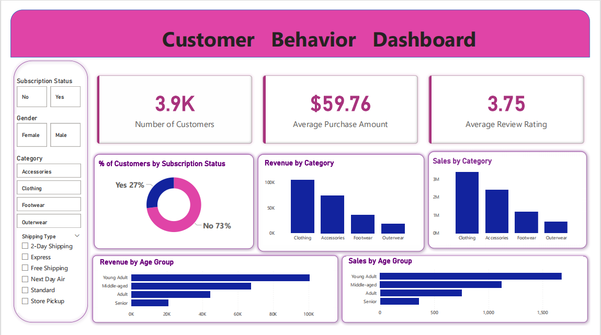

# 👥👥 🛍️🛒 👩‍💻
# Customer Shopping Behavior Analysis
### *Data-Driven Insights into Consumer Purchasing Patterns*

---

## 📑 Table of Contents
- 🛍️ [Project Overview](#project-overview)
- 🏗️ [Project Architecture](#project-architecture)
- 📂 [Dataset Description](#dataset-description)
- 🔎 [Key Analysis Areas](#key-analysis-areas)
- 🛠️ [Tools & Technologies](#tools--technologies)
- 📊 [Dashboard Concept](#dashboard-concept)
- 🧩 [Model View](#model-view)
- 🖼️ [Power BI Dashboard](#power-bi-dashboard)
- 🔄 [Project Workflow](#project-workflow)
- 🗂️ [Project Structure](#project-structure)
- ▶️ [How to Run](#how-to-run)
- 💼 [Business Value](#business-value)
- 📌 [Business Recommendations](#business-recommendations)
- ✅ [Conclusion](#conclusion)

---

## Project Overview

This project analyzes **customer shopping behavior** using transactional retail data to understand purchasing patterns and customer preferences.

The analysis focuses on buying trends, repeat purchases, discount usage, demographic segmentation, and seasonal insights to support data-driven business decisions.

Technologies used: **Python (Jupyter Notebook), SQL (PostgreSQL), and Power BI**.

---

## Project Architecture


```
Raw CSV Data
      ↓
Python (Data Cleaning & EDA)
      ↓
PostgreSQL (Business Queries & Segmentation)
      ↓
Power BI (Dashboard & Visualization)
      ↓
Business Insights & Recommendations
```

This represents a complete end-to-end analytics workflow from raw data to actionable insights.

---

## Dataset Description

- 📊 **Total Records:** 3,900  
- 🗂️ **Total Columns:** 18  

### Key Attributes

- 👤 Customer demographics (Age, Gender, Location, Subscription Status)  
- 🛒 Purchase details (Item Purchased, Category, Purchase Amount, Season, Size, Color)  
- 💸 Discount indicators  
- ⭐ Customer ratings and reviews  
- 🔁 Purchase frequency  
- 🚚 Shipping preferences  

---

## Key Analysis Areas

- 🛍️ Customer buying behavior  
- 🔄 Repeat vs one-time buyers  
- 💰 Impact of discounts  
- ⭐ Rating influence on purchases  
- 🌦️ Seasonal demand trends  
- 📦 Subscription behavior  

---

## Tools & Technologies

- 🐍 **Python** – Data cleaning, transformation, exploratory analysis  
- 🗄️ **SQL (PostgreSQL)** – Business queries and segmentation  
- 📊 **Power BI** – Data visualization and dashboard reporting  

---

## Dashboard Concept

The dashboard highlights:

- 📈 Key Performance Indicators (KPIs)  
- 👥 Customer segmentation  
- 💵 Revenue trends  
- 💸 Discount effectiveness  
- 🚚 Shipping distribution  

---

## Model View


The model consists of a single main table named **`public customer`**.

### Fields in `public customer`

- **customer_id** – Unique customer identifier  
- **Age Category Clean** – Cleaned age classification  
- **age_group** – Grouped age segments  
- **gender** – Customer gender  
- **category** – Product category  
- **item_purchased** – Purchased item  
- **Color** – Product color  
- **discount_applied** – Indicates if discount was used  
- **Frequency of Purchases** – Purchase frequency indicator  

This structure combines demographic and purchase behavior data to support segmentation and reporting.

---

## Power BI Dashboard



The final dashboard visualizes customer trends, revenue insights, discount impact, and segmentation analysis.

---

## Project Workflow

1. 📥 Data collection  
2. 🧹 Data cleaning (Python)  
3. 🔎 Exploratory analysis  
4. 🗄️ SQL-based insights  
5. 📊 Dashboard development  
6. 💡 Business recommendations  

---

## Project Structure

```
Customer-Behaviour-Analysis/
├── data/
│   └── customer_transactions.csv
├── notebooks/
│   ├── data_cleaning.ipynb
│   └── exploratory_analysis.ipynb
├── sql/
│   └── business_queries.sql
├── project_architecture.png
├── model_view.png
├── customer_behaviour_dashboard.png
└── README.md
```

---

## How to Run

1. Clone the repository  
2. Install required Python libraries (`pandas`)  
3. Run Jupyter notebooks  
4. Execute SQL queries in PostgreSQL  
5. Open Power BI dashboard  

---

## Business Value

- 🤝 Improves customer targeting  
- 📈 Optimizes marketing strategies  
- 💖 Supports customer retention  
- 💵 Enables data-driven pricing decisions  

---

## Business Recommendations

- 🎯 Target high-value customers  
- 💵 Use strategic discount campaigns  
- 🔄 Encourage repeat purchases  
- 📦 Optimize logistics strategy  
- 📊 Leverage analytics for growth  

---

## Conclusion

This project demonstrates a complete customer behavior analysis workflow integrating **Python, SQL, and Power BI** to transform raw transactional data into actionable business insights.
