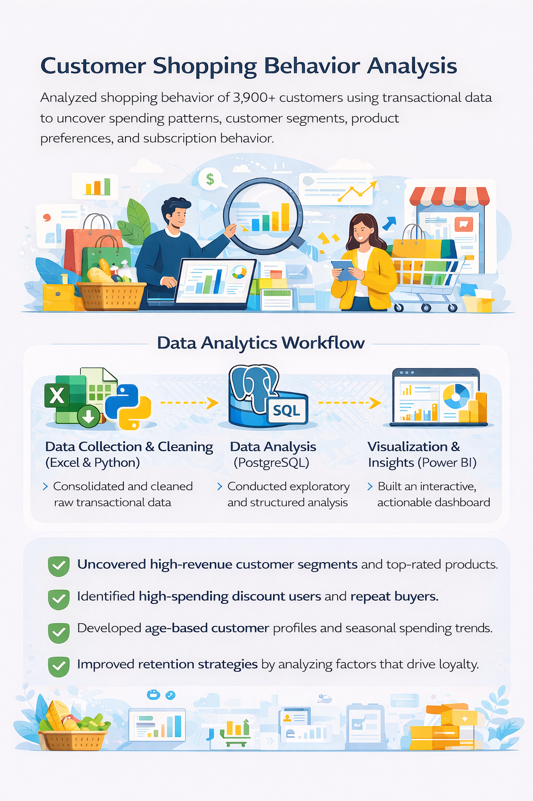
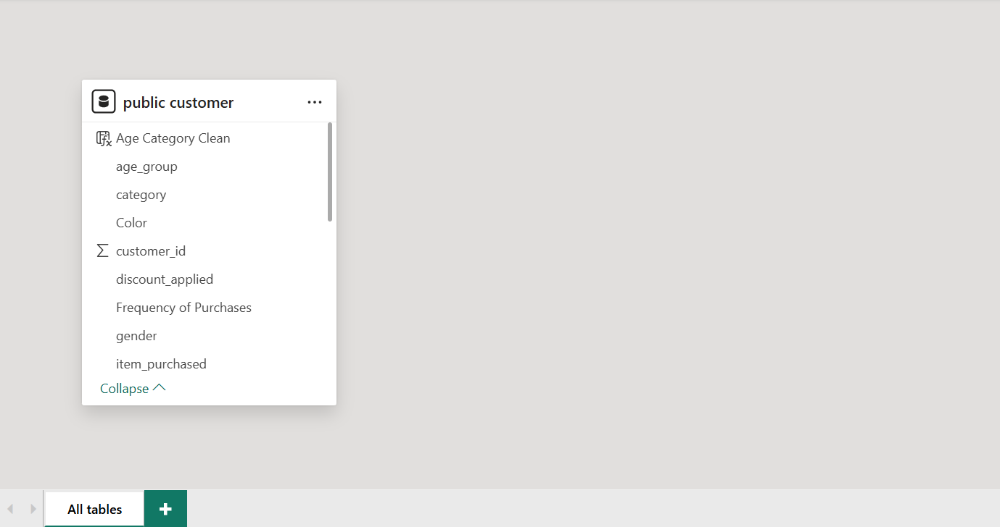

# 👥👥 🛍️🛒 👩‍💻
# Customer Shopping Behavior Analysis
### *Data-Driven Insights into Consumer Purchasing Patterns*

---

## 📑 Table of Contents
- 🛍️ [Project Overview](#project-overview)
- 🏗️ [Project Architecture](#project-architecture)
- 📂 [Dataset Description](#dataset-description)
- 🔎 [Key Analysis Areas](#key-analysis-areas)
- 🛠️ [Tools & Technologies](#tools--technologies)
- 📊 [Dashboard Concept](#dashboard-concept)
- 🧩 [Model View](#model-view)
- 🔄 [Project Workflow](#project-workflow)
- 🗂️ [Project Structure](#project-structure)
- ▶️ [How to Run](#how-to-run)
- 💼 [Business Value](#business-value)
- 📌 [Business Recommendations](#business-recommendations)
- ✅ [Conclusion](#conclusion)

---

## Project Overview

This project analyzes **customer shopping behavior** using transactional retail data to understand how customers interact with products and services.

Focus areas include **buying patterns, repeat purchases, discounts, reviews, seasonal trends, and customer preferences** to support **data-driven business decisions**.

Technologies used: **Python (Jupyter Notebook), SQL (PostgreSQL), and Power BI concepts**.

---

## Project Architecture



```
Raw CSV Data
      ↓
Python (Data Cleaning & EDA)
      ↓
PostgreSQL (Business Queries & Segmentation)
      ↓
Power BI (Dashboard & Visualization)
      ↓
Business Insights & Recommendations
```

This architecture represents a complete **end-to-end data analytics pipeline**, from raw transactional data to strategic decision-making.

---

## Dataset Description

- 📊 **Total Records:** 3,900  
- 🗂️ **Total Columns:** 18  

### Key Attributes

- 👤 Customer demographics (Age, Gender, Location, Subscription Status)  
- 🛒 Purchase details (Item Purchased, Category, Purchase Amount, Season, Size, Color)  
- 💸 Discount and promotion indicators  
- ⭐ Customer reviews and ratings (missing values handled)  
- 🔁 Purchase frequency and repeat behavior  
- 🚚 Shipping type preferences  

---

## Key Analysis Areas

- 🛍️ Customer buying behavior  
- 🔄 Repeat vs one-time customers  
- 💰 Impact of discounts on purchasing decisions  
- ⭐ Influence of customer reviews and ratings  
- 🌦️ Seasonal demand trends  
- 📦 Subscription and shipping behavior  

---

## Tools & Technologies

- 🐍 **Python** (Pandas, Jupyter Notebook) – Data cleaning, transformation, EDA, feature engineering  
- 🗄️ **SQL** (PostgreSQL) – Business analysis, customer segmentation, revenue insights  
- 📊 **Power BI** – Dashboarding and visualization of key business metrics  

---

## Dashboard Concept

The Power BI dashboard highlights:

- 📈 Key Performance Indicators (KPIs)  
- 👥 Customer segmentation insights  
- 💵 Revenue and trend analysis  
- 💸 Discount effectiveness  
- 🚚 Shipping preference distribution  

---

## Model View



The data model is structured for optimized reporting and analysis.

- 🧩 Fact table containing transactional purchase data  
- 📂 Dimension tables for customers and product categories  
- 🔗 Relationships defined using primary and foreign keys  
- 📊 Optimized schema for Power BI performance  

---

## Project Workflow

1. 📥 Data collection and understanding  
2. 🧹 Data cleaning and preparation (Python / Jupyter Notebook)  
3. 🔎 Exploratory Data Analysis (EDA)  
4. 🗄️ SQL-based business analysis  
5. 💡 Insight generation  
6. 📊 Dashboard visualization (Power BI)  

---

## Project Structure

```
Customer-Behaviour-Analysis/
├── data/
│   └── customer_transactions.csv
├── notebooks/
│   ├── data_cleaning.ipynb
│   └── exploratory_analysis.ipynb
├── sql/
│   └── business_queries.sql
├── project_architecture.png
├── model_view.png
└── README.md
```

---

## How to Run

1. 📋 Clone the repository  
2. 🐍 Install required Python library: `pandas`  
3. 📝 Run Jupyter notebooks for data cleaning and EDA  
4. 🗄️ Load cleaned dataset into PostgreSQL  
5. 💻 Execute SQL queries provided  
6. 📊 Explore insights using the Power BI dashboard  

---

## Business Value

- 🤝 Enhances customer engagement through **targeted insights**  
- 📈 Optimizes marketing campaigns and promotional strategies  
- 💖 Supports **customer retention and loyalty programs**  
- 💵 Enables informed decisions on **pricing, discounting, and product offerings**  

---

## Business Recommendations

- 🎯 **Focus on high-value customers**  
- 💵 **Implement targeted promotions**  
- 🛒 **Promote top-rated products strategically**  
- 🔄 **Encourage repeat purchases**  
- 📦 **Optimize logistics and shipping**  
- 👥 **Personalize customer interactions**  
- 📊 **Leverage data for strategic improvement**  

---

## Conclusion

This project demonstrates a **complete end-to-end customer behavior analysis**, transforming raw transactional data into **actionable business insights**.

By integrating **Python, SQL, and Power BI**, the project mirrors **real-world data analyst workflows** and supports strategic decision-making for retail businesses.
